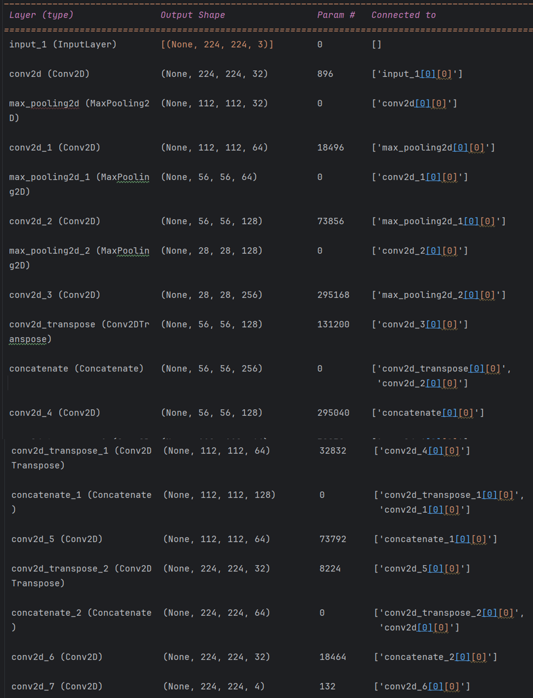
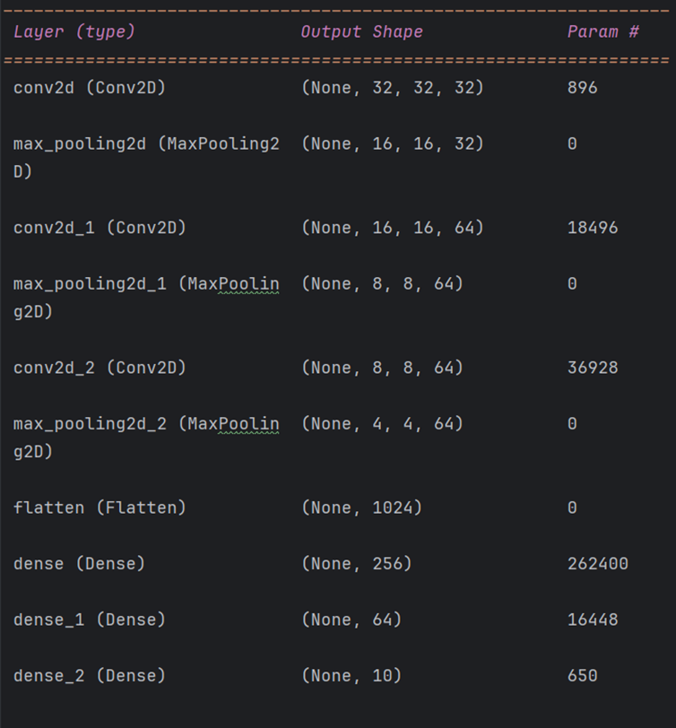

# big_data_and_parallel_processing_finall_project

#  Docker
برای داکرایز کردن پروژه ما دو فایل تنظیم کردیم یکی requirements.tx که شامل تمامی کتابخانه های مورد استفاده در پروژه همراه با ورژن آنهاست و یکی هم فایل Dockerfile شامل آنچه که باید روی ایمیج کانتینر سرور نصب شده و کامند هایی که باید زده شود 
حال برای اجرای فایل بر روری سرور تنها زدن دو کامند بیلد و ران کافیست و فایل داکرایز شده و اجرا میشود

# fastAPI
در این پروژه ما یک هسته اصلی پروژه به نام main.py داریم که بواسطه fastAPIصفحه index.html را به هر کاربری که درخواست دهد نمایش میدهد و این صفحه از کاربر /انچه که نیاز دارد را میگیرد (مثلا خروجی کدام پروژه را قصد دارد بررسی کند و یا کدام بخش از پروژه را و...) بنا به انتخاب کاربر, یک api  از سمت کاربر به سرور ارسال میشود شامل اینکه کاربر چه میخواهد
اگر تصویر همراه با نوع شبکه ارسال شود هسته برنامه تصویر را ذخیره کرده و به مدل ساخته شده از شبکه انتخابی کاربر میدهد خروجی که یا یک ماسک یا یک برچسب است را از کاربر گرفته و به صفحه image_result.html ارسال میکند و این صفحه خروجی را نمایش میدهد اگر شبکه cnn انتخاب شده باشد تصویر ورودی را همراه با برچسبش و اگر fcn باشد ماسک را برمیگرداند
حال اگر کاربر انتخاب کند که خروجی پروژه پردازش موازی را میخواهد باید انتخاب کند که خروجی کدام پارت و خروجی کدام سکشن از آن پارت و خروجی کدام سناریو را میخواهد با انتخاب اینها,  همگی به سرور میروند و سرور بنا به انتخاب های کاربر کد مد نظر کاربر را اجرا میکند و خروجی کد را در یک ساختمان داده ذخیره کرده و به هسته برنامه برمیگرداند و هسته برنامه خروجی را به صفحه result.htmlمیفرستد و آن صفحه خروجی را چاپ میکند
لازم به ذکر میدونم که بگم طی بررسی که بنده کردم کد های مالتی پراسس برای اجرا  لزومی ندارد که در ترمینال اجرا شوند بلکه لازم است برای اجرا فایل اجرا کننده اش شامل 

if __name__ =='__main__':

باشد برای همین کامند اجرای هسته برنامه را داخل خودش نوشتم که مشکلی برای اجرای کدهای مالتی پراسس ایجاد نشود 

#  Big Data
#       FCN:
برای پیاده سازی شبک fcn برو روی داده هایoxford_iiit_pet لازم بود در ابتدا تصاویر ورودی را نرمال سازی کنیم که کد این نرمال سازی در فایلprepross.py در دسترس است پس از نرمال سازی باید شبکه ای طراحی کرده و داده هارا به آن میدادیم برایم آموزش و ارزیابی مدل
برای این امر ما ازین شبکه استفاده کردیم

سپس دقت مدل را نهایتن ارزیابی کرده و مدل ساخته شده را به اسم final_model_fcn.h5ذخیره میکنیم
حالا برای استفاده از این مدل ساخته شده به فایل fcn_use_model.py مراجبعه میکنیم درین فایل مدل پیشتر ساخته شده را خوانده و تصویر ورودی را پس از نرمال سازی به آن داده و ماسک خروجی را به نحوی که تفاوت ها برای انسان قابل مشاهد باشد تغییر داده و بصورت یک تصویر ذخیره میکنیم و آدرس آن تصویر را برمیگردانیم 
دکتر برای برخی داده ها شبکه fcn من خروجی درستی میده من اونهارو توی ریپازتوری پروژه فولدر استاتیکز میذارم نگاه کنید
اونهایی که رو که نشون نمیده هم دلیلش اینه که چون برش میخوره چیزی که داخل تصویر میمونه چیزی برای نمایش نیست همه اونجه که میمونه یک برچسب داره
# CNN:

مثل قبلیه منتها اینجا دیگه نیازی به نرمال سازی نیست چون خود داده نرمال هست داده را از ورودی خوانده و به بخش های ورودی و خروجی تقسیم میکنیم
سپس با شبکه ای به صورت زیر آموزشش میدهیم

و در نهایت مدل حاصله را ذخیره میکنیم
و مثل قبلی یک فایل برای استفاده از مدل ایجاد میکنیم که تصویر را از ورودی گرفته مدل مذکور را خوانده و تصویر را به مدل داده و برچسب تصویر را صمن بدست آوردن برچسب, آنرا برمیگرداند

# Parallel Processing
# part one : Thread-Based Parallelism
برای نمایش خروجی هر تمرین تمامی خروجی هارا در یک لیست گلوبار ذخیره میکنیم و در نهایت آن لیست را به هسته برنامه بازمیگردانیم و در آنجه به صفحه نتایج پاس داده میشود
# 1) Defining a thread:
کد به شدت ساده و قابل فهم است فلذا از توضیح آن صرف نظر کرده و تنها به شرح سناریو ها بسنده میکنیم
سناریو اول به این صورت است که هر تردی که ایجاد شد صبر میکند تا تمام شود و سپس به سراغ ایجاد و اجرای ترد بعدی میرود
در سناریوی دو برعکس اولی نخست تمامی سناریو ها اجرا میشوند سپس صبر میکند  تا همگی تمام شوند این سناریو سریع ترین سناریو است
سناریو سهاین سناریو که ترکیب دو سناریو قبلی است به این صورت است که نصف نخ هارا به سورت خطی و مابقی را یکجا اجرا میکند

# 2) Determining the current thread
به این صورت است که هر تابع یک پارامتر رندوم میگیرد و پیام استارت میدهد و بنا به پارا متر رندومی که گرفته است متوقف میشود و سپس پیام پایان میدهد

 من برای اجرای سناریو های مختلف این کد به اینصورت عمل کردم که در سناروی اول, نخست همه توابع استارت شود و سپس انتظار برای پایان آنها اعمال شود (به شورت موازی اجرا شوند)
 در سناریو دوم به این صورت عم کردم که علی رقم مولتی ترد بودن برنامه, توابع با استفاده از join بصورت خطی اجرا شوند
 در سناریو سوم هم به اینصورت که دو تابع آخر بصورت موازی باهم و به صورتی خطی نسبت به اولی اجرا شوند
 # 3) Defining a thread subclass
این کد کل سناریو هاش دقیقا مثل سکشن 1 هست با این تفاوت که در اینجا به ترد ها اسم مد نظر خود را میدهیم 
اما تفاوت اصلی آن با کد سکشن اول در این است که  کد مالتی ترد را به صورتی میزنیم که هر ترید بعنوان یک کلاسی تعریف شود که از تردینگ ارس بری میکند استفاده از کلاس سبب میشود که دسترسی بیشتری به ابزار های تردینگ به ما میدهد و امکان شخصی سازی بیشتر را فراهم میکند
درین روش کدی که قصد اجرای آنرا داریم را در تابع run کلاس نوشته و برای اجرا گرفتن آن مثل قبل از .start()
استفاده میکنیم

# 4) Thread synchronization with a lock
 اینجا از لاک استفاده میکنیم به این صورت که ترد به داری که بخشی است که نباید همزمان اجرا شود برای این امر از لاک استفاده میکنیم به این صورت اولی که به آن ناحیه بحرانی رسید لاک را برای خود برمیدارد و وقتی دیگری رسید منتطر میماند تا اولی کارش تمام شود و سپی آن لاک را برمیدارد و دوباره بعدی که رسید را منتطر میگذارد و الی آخر
 
سه نیاریو پیاده کردیم به این شرح :
اولی به اینصورت که نخست همه ترد ها را اجرا کرده و سپس منتظر اتمام همه میماند
دومی هم مثل اول اجرا میضود منتها لاک تنها رو بخش اسلیپ آن قرار دارد و باقی به صورت موازی اجرا میشوند سومی هم مثل دوتا قبلی است اما لاک بر روی بخش آغازین ترد ها قرار دارد

# 5) Thread synchronization with RLock
شامل دو تابع است که یکی اد میکندو دیگری حذف میکند (آن تعدادی که به صورت رندوم از ورودی  میگیرد) و زمان اضافه کردن یا حذف کردن برنامه قفل میشود تا به صورت همزمان اضافه یا حذف نشود
سناریو ها در زمان های اسلیپ که داخل قفل ها دارند متفاوت اند و این امر سبب متفاوت شدن خروجی میشود

# 6) Thread synchronization with semaphores
مسئله تولید کننده و مصرف کننده است که با سمافور پیاده سازی شده است به این صورت که تولید کننده پس از تولید یکی به مقدار سما فور اضافه میکند و مصرف کننده یکی کم میکند زمانی که صمافور 0 شد مصرف کننده سبر میکند تا این مقدار تغییر کند و در همین حین تولید کننده باز تولید میکند تا تا مصرف کننده بتواند باز هم مصرف کند
سناریو اول به این صورت است که ابتدا 10 تولید کننده و 10 مصرف کننده ایجاد شده و با سمافور همگامی آنها مدیریت شده و در نهایت همگی با join به اتمام میرسند
سناریو دوم هم به این صورت است که نخست همه مصر ف کنندگان نخ هایشان ایجاد شده منتطر میماننده تا تولید کنندگان تولید کنند
سناریو سوم هم به این صورت که یک تولید کننده و یک مصرف کننده اجرا شده و منتظر میماند تا تمام شود فرایند تولید و مصرف و سپس به سراغ اجاد نخ های تولید و مصرف بهدی میرود

# 7) Thread synchronization with a barrier
این پیاده سازی یک مسابقه با استفاده از بریر است به این صورت که پس از به خط پایان رسیدن همه  بازیکنان پیام بازی تمام شد چاپ مسابقه تمام شد در دو سناریو اول بدون استفاده از برید این امر را محقق ساختیم در سناریو اول با استفده از یک متغیر سراسری اینکار را کردیم و در سناریو دوم به کمک همان صفت join این امر محقق شد در سناریو آخر هم با بریر اینکار را انجام دادیم

# part tow : Process-Based Parallelism
برای نمایش خروجی هر تمرین تمامی خروجی هارا در صف ذخیره کرده و در نهایت پس از اتمام برنامه درای های صف را یک به یک در یک لیست قرار داده و در نهایت آن لیست را به هسته برنامه بازمیگردانیم و در آنجه به صفحه نتایج پاس داده میشود
# 1) Spawning a process
این دقیقا مثل سکشن اول تردینگ است با این تفاوت که اینجا مالتی پراسسینگ بجای تردینگ قرار دارد و کد تابع اجرایی یک ورودی دارد و به اضای آن عدد ورودی خط در خروجی چا میکند ین اگر 5 باشد 4و3و2و1و0 را چاپ میکند و سناریو ها و باقی چیزها مثل قبل است
# 2) Naming a process
درینجا به فرایند ها نام اختصاری خودشان را اختصاص میدهیم و داخل فراین نام هر فرایند را بدست می آوریم 
سناریو ها به این صورت است که در سناریو اول طبق روال بالا هر دو فرایند یک با نام اختصاصی و دیگری با نام عادی استارت شده و سپس منتظر پایانش میمانیم در سناریو دوم برعکس سناریو قبل اول یک فرایند اجرا سپس دیگری اجرا میشود یعنی عملکرد خطی دارد نخه موازی 
 در سناریو سوم اما تابع اجرایی را تغییر داده و تایم اسلیپ را برداشته و زمان اجرا را تا حد امکان کاهش داده ایم
# 3) Running processes in the background
 سناریو هایی که در بکگران اجرا میشوند خروجی نمیدهند اما ما اینجا خروجی هارا در صف ریخته و نمایش میدهیم که درین حالت باید همه خروجی ها نمایش داده شود پس برای نشان دادن تفاوت اجرای فراند های پس زمینه شرط گذاشتیم که اگر پس زمینه بود خروجی را در صف نریز
 سناریو اول فرایندی که اسم بگراند دارد بکگران است و دیگری غیر بکگران خروجی هم به همین منوال است در سناریو بعدی هردو برنامه غیر بکگران هستند اما باز هم خروجی فرایند بکگران نمایش داده نمیشود به همان دلیل فوق سناری. اسوم هم هردو فرایند بکگران هستند اما خروجی مثل قبل است به دلیل بالا
 # 4) Killing a process
درین سکشن مفهوم کشتن فرایند هارا بررسی میکنیم کشتن به این معنی که قبل از آنکه فرایند تمام شود تمامش میکنیمیک تابع داریم که فرایند مد نظر ما میشود که اعداد 0 تا 10 در هر ثانیه چاپ میکند
در سناریو اول ما لحظه ای پس از اجراآنرا میکشیم !
در سناریو دوم آنقدر صبر میکنیم تا دیگر زنده نباشد و بعدش میکشیمش ! 
در سناریو آخر هم به آن 5 ثانیه وقت میدهیم تا تمام شود چه شده بود چه نه آنرا میکشیم!!
# 5) Defining processes in a subclass
اجرای فاریند ها در کلاس که تفاوت چندادنی در خروجی و سناریو های ما ندارد منتها اگر فرایند هارا در کلاسی که از کلاس مالتی پراسسینگ ارث بری مکنند قرار دهیم توانایی توصعه بیشتری خواهیم داشت در سناریو اول بصورت خطی اجرایش میکنیم در سناریو دوم به صورت کاملن مواز و در سنارو آخر بصورت نصف خطی و نصف مواز اجرایش میکنیم

 # 6) Using a queue to exchange data
مصئله تولید کنند و مصرف کننده را با استفاده از صف برای جابجایی اطلاعات میان ترد ها استفاده میشود
در سنارو اول برای همگام سازی از اسلیپ های استفاده کردایم  که مشکلی پیش نیاید
در سناریو دوم از سمافور و حلقه هارا داخل خود مصرف کننده و تولید کننده گذاشتیم 
و در سناریو آخر از join استفاده کرده ایم

# 7) Synchronizing processes
اینجا در سناریو اول اجرای دو فرایند با بریر و اجرای بدون آنرا مقایسه کرد 
در سناریو دو سعی بر آن کردیم که سمافور را جایگزین بریر کنیم و تاحد همموفق واقع شد
و در سناریو آخر هم با حذف لاک نتیجه یکسانی برمیگردانیم
# 8)Using a process pool
از استخر برا یاجرای موازی فرایند هایی برای محاسباتی بر روی آرایه استفاده میکنیم
در سناریو اول به صورت معمولی یک ساتخر ساخته آنرا مپ میکنیم به تابع و خروجی هارا دریافت میکنیم
و سپس استخر را میبندی و منتظر اتمام برنامه میمانیم
در سناریو دوم از تگ with برای استخر استفاده میکنیم 
در نیاریو آخر همبجای عمل توان 2 از عمل توان 3 استفاده میکنیم
